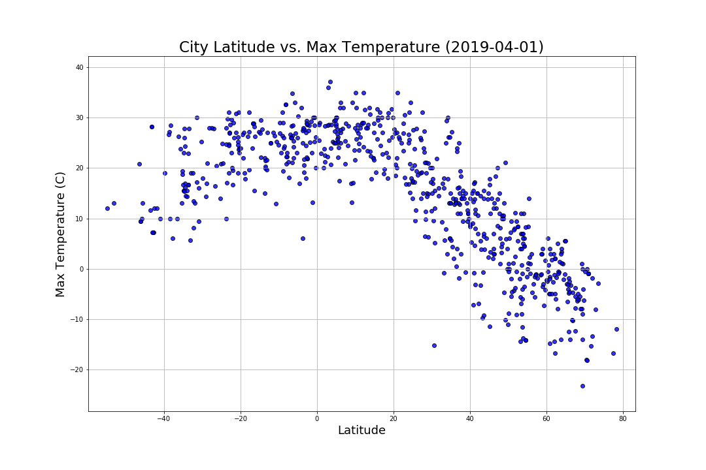
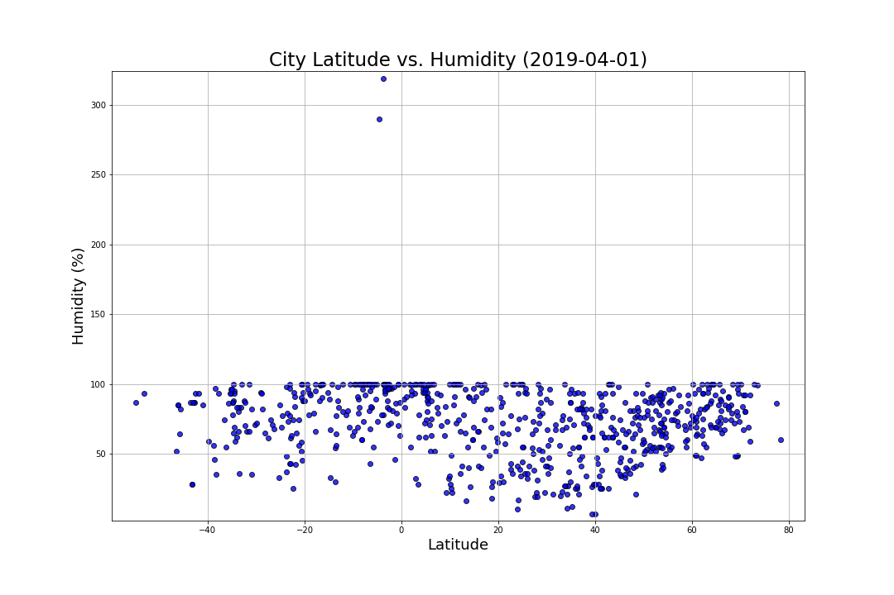

# Latitude vs. Weather
An html/css page was created to present an analysis that compares the latitude and its consequences in some climate characteristics.
url: https://ogmaribel.github.io/start

## Hypothesis
The weather changes as you get closer to the equator.

## Sources
To accomplish this analysis, we first pulled data from the OpenWeatherMap API to assemble a dataset on over 500 cities.

## Results
### Temperature
The weather becomes significantly warmer as one approaches the equator (0 Deg. Latitude).

### Humidity
Humidity appears to be regularly compared with the latitude. The only pattern that can be seen in these plots is that the humidity is high in the regions close to the equator (0 Deg. Latitude) probably related to the tropical climates.

### Cloudiness
The cloudiness does not have a relationship with the latitude. The values inside the plot are widely distributed in all areas.

### Wind Speed
The wind speed seems to increase the further away from the equator (0 Deg. Latitude).

Congratulations! You've decided to treat yourself to a long holiday vacation in Honolulu, Hawaii! To help with your trip planning, you need to do some climate analysis on the area. The following outlines what you need to do.

## Step 2 - HTML/CSS Web characteristics
This web page was developed using several bootstrap tools:
* The selection buttons have icons and the plot button has a dropdown section
* The selection buttons also will disappear when the screen size is bellow to medium and instead it will be replaced by a menu button. This menu button will display the selections options when the user click on it and will scroll down all the content bellow.

